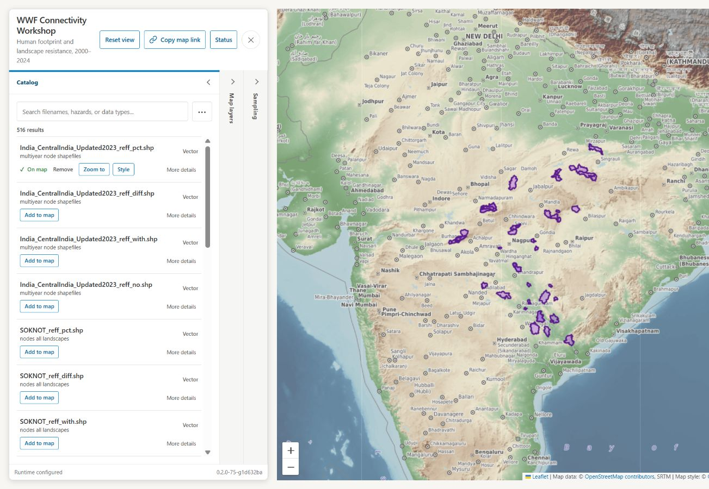
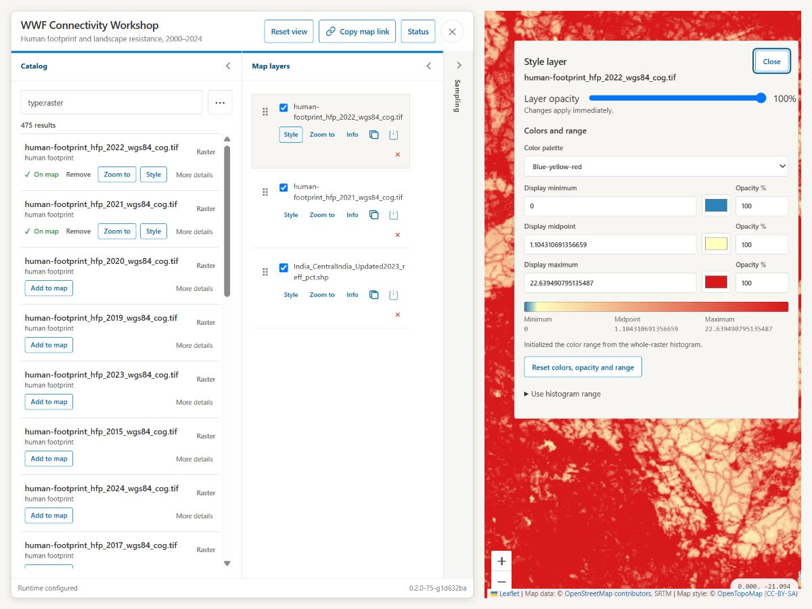
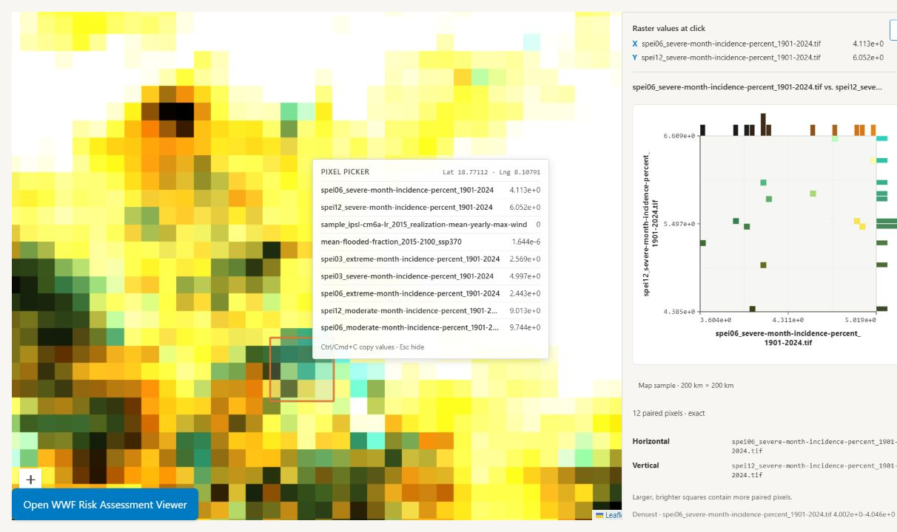
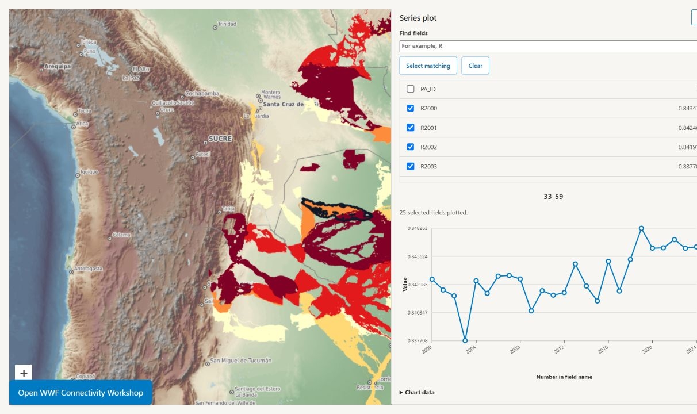

# EOLab

EOLab is a shared browser workspace for exploring prepared raster and vector
data. It turns a folder of geospatial files into a searchable Catalog where a
group can build maps, inspect features and pixels, compare rasters, make plots,
and share the exact view with a link.

It is especially useful for workshops and collaborative analysis. A facilitator
can publish the participants' datasets once, and everyone can explore the same
material in real time without installing a desktop GIS or creating an account.

## What can you do with EOLab

- Search a shared Catalog by filename, path, date, or dataset type.
- Add several rasters and vectors to one map, reorder them, and control which
  are visible.
- Style rasters with color ramps and opacity.
- Style points, lines, and polygons with one symbol, categories, or graduated
  numeric classes; add labels when useful.
- Click the map to inspect vector attributes and sample raster pixels.
- Draw a sampling window and compare raster distributions with 1D or 2D
  histograms.
- Plot several fields from one feature, or one numeric field across all
  features found at a location.
- Copy a link that recreates the layers, styles, order, visibility, opacity,
  viewport, and viewer version.

For example, a landscape-connectivity workshop can combine annual resistance
rasters with corridor or node vectors. Participants can compare raster values
at a location, inspect the attributes of overlapping features, plot how a
metric changes across years, and send a colleague a link to the resulting map.

## A quick tour

### Find a dataset

Use **Catalog search** to enter any part of a filename, path, description, or
date. Ordinary words can be combined with these filters:

- `type:raster` — only raster datasets
- `type:vector` — only vector datasets
- `format:cog` — only Cloud Optimized GeoTIFFs
- `date:2020`, `date:2020-06`, or `date:2020-06-15` — a year, month, or day
- `date:2020-01..2020-03` — an inclusive date range

For example, `resistance type:raster date:2020` finds raster records containing
“resistance” from 2020. Suggestions appear while you type. Clear the search to
show the complete Catalog, or use **Surprise me** to open a random matching
item.

Each result shows the source filename and the actions you are most likely to
need:

- **Add to map** publishes and displays the dataset.
- **More details** opens its Catalog metadata.

After an item is on the map, the same row also offers **Remove**, **Zoom to**,
and **Style** without making you leave the search results.

### Build the map

Open **Map layers** to see the current stack. The first layer in the list draws
on top. Drag a row by its handle to reorder it, or use the keyboard controls on
the same handle.

Each layer row provides small, direct actions:

- the checkbox shows or hides the layer;
- **Style** changes its appearance;
- **Zoom to** fits the source layer's bounds;
- **Info** opens the Catalog details;
- **Copy** and **Paste** reuse a compatible style, including layer opacity;
- **×** removes the layer from the map.

Raster styles offer minimum, midpoint, and maximum colors and opacities. Vector
styles adapt to point, line, or polygon geometry. They support a single symbol,
categorical values, graduated numeric classes, and optional labels. Appearance
changes affect only the current map; they never edit the source data.

### Explore what is under the pointer

A normal click explores the visible data at that location. Dragging still pans
the map. **Analysis tools** performs the same action at the center of the map,
which is useful for keyboard and touch interaction.

For visible vectors, EOLab highlights the features under the click and opens
their attributes in **Feature inspector**. Use **Previous** and **Next** when
several features overlap. Clicking empty space does not open an empty result.

For visible rasters, EOLab samples the pixel values and prepares histograms. A
bounded sample window can be moved or resized to explore a local distribution:

- **1D** mode shows distributions for the active visible rasters.
- **2D** mode compares the top two visible rasters and marks them **X** and
  **Y** in Map layers. Reorder those layers to change the pair, or swap the axes
  in the analysis panel. Other layers stay in Map layers but are temporarily
  hidden from the map while 2D mode is active.

### Make a series plot

After selecting vector features, the inspector offers two complementary plots:

- **Plot fields from this feature** graphs several numeric attributes from the
  current feature. This fits data where fields such as `R2000` through `R2024`
  contain a series within each feature.
- **Plot one field across features** graphs one numeric attribute for every
  feature available through **Previous** and **Next**. Choose the X-axis field
  or filename order, ascending or descending order, and a line or scatter
  chart.

Selecting a chart point identifies its source layer and offers **Zoom to source
layer**. EOLab remembers the plot rules while you inspect other features from
the same layer, so the chart updates instead of making you configure it again.

### Share your map

Use **Copy map link** to copy the current map as a URL. The link contains a
compressed map-view document in its URL fragment, so opening it recreates the
shared viewport and layers without uploading a separate file. Every referenced
Catalog item is revalidated before use; the source data itself is not embedded
in the link.

The browser also remembers the last valid map on that deployment. **Reset
view** returns to an empty map and the configured starting position. **Undo
reset** restores the immediately previous map.

## Add your own data

EOLab deployments read from a configured, read-only data directory. A workshop
facilitator or deployment operator normally follows this flow:

1. Prepare georeferenced GeoTIFFs and vector datasets before the session.
2. Copy them into the deployment's mounted data directory.
3. Open **Status**, find the Catalog section, and select **Scan directories**.
4. Review any dataset-specific errors without interrupting successful files.
5. Search for a representative raster and vector, add both to the map, and
   verify their bounds and appearance.

Scanning again updates files that are still present and removes Catalog items
whose mounted source files have disappeared. The source mount remains
read-only; EOLab stores Catalog metadata and generated GeoServer configuration
elsewhere.

Raster rendering currently expects prepared, georeferenced, single-band
GeoTIFFs. EOLab does not rewrite or optimize them during scanning. Mounted
Shapefiles and spatial GeoPackage layers can be added to the map. Other
recognized vector containers may be searchable in the Catalog even when they
are not yet renderable.

For a one-off overlay that should not enter the shared Catalog, use **Upload
AOI** with a GeoPackage or zipped Shapefile. Temporary AOIs expire and are not
included in copied map links.

## Running your own EOLab workspace

Deployment owners can run EOLab with Docker Compose or Coolify. The concise
[deployment and operations guide](docs/deployment-and-operations.md) covers the
required passwords, read-only data mount, startup, scanning, verification, and
resource controls. More detailed behavioral and architecture contracts live in
the [`docs`](docs) directory.

EOLab is open-source software under the [Apache License 2.0](LICENSE).
