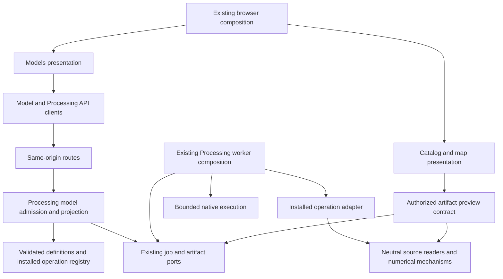

# Models: architecture and version-1 contracts

Status: design for [#694](https://github.com/springinnovate/eolab/issues/694),
tracked by [#449](https://github.com/springinnovate/eolab/issues/449).
The backend foundation in [#695](https://github.com/springinnovate/eolab/issues/695)
implements the installed raster-summary recipe, model API, existing-queue execution
and YAML exports described below. The Models UI, downstream adapter, multiple
artifacts, previews and Save remain follow-up work. These features were not part
of the tagged EOLab 0.9.0 release.

The implementation baseline inspected for this design is main commit
`e9ffef35be759a1d4de776e6a61cc95e37e82cf7`. Subsequent work must inspect current
main and preserve its contracts rather than treat these paths as frozen code.

## Product decisions and gates

Models live in the right-hand Analysis area: **Library → Setup → Run**, with a
compact **Runs** entry. Catalog sources and displayed layers remain on the left.
Map context supplies suggestions, never implicit authority or accepted inputs.
Ambiguous suggestions require a choice; hidden or unrendered catalog sources
remain selectable. The setup shows filters, input roles, parameters and units.

Run is explicit. Submission captures the source identities, selection predicates,
model definition and parameter values. Later clicks, filters, visibility changes,
panel closure, map changes and page navigation do not alter or cancel accepted
work. Cancel is explicit; Duplicate with changes opens a new draft. A submission
whose HTTP acknowledgement was lost is recovered with the same idempotency key.

| Decision | Version-1 position | Implementation gate |
| --- | --- | --- |
| Multiple selected vector features | **One combined starting mask and one overall result**, confirmed by richpsharp for #694. Union overlaps; do not double count because two starting features reach the same cell. | #700 proves mask/coverage semantics; #701 states the grouping in the UI. Per-feature results are a future model/version. |
| Run ownership | Use the existing browser-session capability for the first temporary-run slice. Label it Runs, not an account-synchronized personal archive. | #695 preserves same-origin/session authorization. Clearing/losing the cookie loses access. |
| Background work | Accepted work survives navigation and browser closure. | #696 must not inherit Statistics controllers' cancel-on-context-change policy. |
| Worker restart | Unfinished work becomes interrupted; ready files remain until expiry. No automatic checkpoint/resume. | #700 must bound the initial workload accordingly; workloads requiring restart recovery need separate approved work before activation. |
| Temporary retention | Use the deployment's Processing result lifetime; current default is 24 hours after completion. Show the actual server deadline. | #697 accounts for every retained byte and transfer. |
| Temporary run metadata | Retain the bounded definition/invocation and sanitized outcome for seven days after terminal completion, independently of scratch/output cleanup, subject to owner access. | #695 must preserve this model-specific record within admission/count/byte limits; current cleanup clears `spec`, so storing the only copy there is insufficient. This is not indefinite Save. |
| Save | Private retention of an explicit recipe/result set, separate from publication. | **Blocked on an ownership/access decision in #702**: browser capability with a durable recovery policy, or an existing/approved user/project identity. Do not invent accounts or merely extend a file TTL. |
| Prepared hydrology | Administrator-configured, versioned catalog sources and topology mappings. | #699 verifies compatibility and coverage. Arbitrary DEM conditioning is outside version 1. |
| Downstream parameters | Buffer and optional **straight-line distance cutoff**; summary defaults to `sum(a)`. | #700 validates units, grids and numerical reference answers. No attenuation/decay parameter. |
| Resource policy | One admitted Processing run owns all its work. Recipe metadata cannot raise deployment limits. | #700 measures a representative supported area and sets an explicit supported-work envelope before enabling hydrology. |

Completed results, coverage and selected diagnostics belong to their run. Show on
map adds a layer under that run's name; it does not publish a catalog item.
Intermediate artifacts are available after successful publication, not by browsing
a live scratch directory. A transient selection mask may be inspected for its run,
but cannot become another run's source or a persistent geometry snapshot.

## Existing owners and evidence at the design baseline

Paths below are relative to the repository. Current code is evidence for the
extension points, not a reason to consolidate different capabilities.

| Existing implementation | Contract to preserve / deliberate extension |
| --- | --- |
| `src/eolab_app/processing/models.py`: `PreparedJobPlan`, `JobSubmission`, `JobResponse`, `ProcessingLimits` | Operation-neutral admission and owned lifecycle. Reuse one job identity; add model-specific contracts above these mechanisms. |
| `src/eolab_app/processing/job_store.py`: `submit`, `claim_next_job`, `heartbeat`, `finish`, `list_owned` | Idempotency, leases, admission and publication fencing. The current recent listing is limited to 50 jobs; model discovery needs its own bounded pagination. |
| `src/eolab_app/processing/service.py`: `public_job`; `routes/processing.py`: `SupportedJobResponse` | Current projection explicitly handles clip/aggregate shapes. Extend model projection deliberately, preserving both old shapes. |
| `src/eolab_app/processing/worker.py`: `_execute`; `native_processes.py`: `create_native_process` | Explicit operation dispatch and preinstalled native targets. Registry dispatch belongs at this application boundary. |
| `src/eolab_app/execution/reusable_process.py`: `_retire` | Stops/joins the direct native process. It does not establish cancellation of arbitrary TaskGraph descendant processes. |
| `src/eolab_app/processing/raster_expression.py`: `compile_expression`; `aggregate_models.py`: `AggregatePlanRequest` | Bounded scalar formulas, exactly one raster binding. Multi-raster map algebra and raster outputs are additional contracts, not existing expression features. |
| `src/eolab_app/catalog_selection.py`: `CatalogSelection`, `CatalogSelectionReader`; `attribute_filter.py`: `VectorFilter` | Original catalog identity, immutable typed predicate and source signature. No copied filtered dataset or reusable geometry authority. |
| `src/eolab_app/raster/source_contract.py`; `raster/models.py`: `CatalogRasterRequest` | Neutral authorized reads and catalog raster identities. No dependency on rendering eligibility or GeoServer. |
| `src/eolab_app/processing/artifacts.py`: `LocalJobArtifacts`; `ports.py`: `JobArtifactStore` | One result file plus provenance today. Multi-file manifests, all-file accounting and previews need explicit extensions. |
| `src/eolab_app/routes/processing.py`: `_owner` | Seven-day HttpOnly browser capability, hashed internally; not a logged-in user. IDs alone grant no access. |
| `frontend/src/processing/api.js`, `jobs.js`: `ProcessingApiClient`, `ProcessingJobs` | Existing transport, changed-event hints and authoritative status reads/polling. Reuse; no notification replacement is proposed. |
| `frontend/src/main.js` | Browser composition coordinates input suggestions, Models, catalog, map and layer presentation. No second top-level coordinator. |

The Job service in [job-service.md](job-service.md) remains responsible for its
existing diagnostic/vector operations. Models extend Processing; they do not
merge these different lifecycles or introduce a third execution queue.
See [raster calculations](raster-calculations.md), [clips](raster-clips.md),
[vector selections](vector-sampling.md) and [operations](deployment-and-operations.md)
for existing contracts.

## Ownership and permitted dependency changes

The #694 design PR changed documentation only. It approved the following
extensions, each owned by its linked implementation issue. The implemented
foundation is described separately below.

| Owner | Used by | Depends on | Coordinates with |
| --- | --- | --- | --- |
| Processing model definitions/admission (#695) | Model HTTP API and worker application composition | Typed definitions, catalog/selection authority, installed operation contracts, existing JobStore ports | Processing status/projection and model packaging |
| Models browser presentation (#696, #701) | Analysis navigation | API clients and neutral form/input values | Catalog, map and layers through `main.js` callbacks |
| Downstream adapter (#700) | Processing worker dispatcher | Prepared hydrology, neutral reads, numerical kernels/expression mechanisms and bounded execution context | Worker-owned progress, cancellation and artifact publication |
| Prepared hydrology contract (#699) | Downstream admission/adapter and model metadata API | Catalog identities, neutral raster/vector metadata and versioned operator configuration | Catalog management through source contracts |
| Processing artifacts/retention (#697, #702) | Worker publication, authorized downloads, Runs UI | Private storage, database reservations, identity and transfer leases | Cleanup and authorized preview invalidation |
| Artifact preview delivery (#698) | Map rendering and Models output actions | Owner-checked immutable artifact capability and neutral bounded readers | Rendering/layers through server and browser composition |

New edges: model routes → model admission/definition contracts; model admission
and worker composition → installed adapters; Models UI → model API; preview
delivery → an authorized artifact-reading port. No existing edge is removed or
reversed. New model modules stay within Processing's application ownership;
storage, native execution and shared readers never import the model registry,
hydrology adapter, routes or UI. The downstream adapter does not call a peer
Statistics/clip service or submit sub-jobs to obtain its numerical work.

The diagram shows contract dependencies, not one HTTP request per edge. Only
composition knows peers. Preview authorization is resolved before a neutral
reader receives a private capability; the reader does not learn the calling UI
or owner policy. Processing never depends on rendering availability. Existing
WMS is not assumed to read Processing's private volume.

Remaining deliberate coupling: model definitions bind to installed operation
contracts and form value types; their versions must evolve together. Dispatch
and response projection remain explicit application composition. Retention and
preview must coordinate immutable artifact identity and expiry. This is a
bounded extension, not a generic plugin/DAG framework or browser coordinator.

## Three documents, one execution

1. **Model YAML** is a reusable recipe: input roles, parameters, one installed
   operation invocation, declared outputs and presentation hints. It contains no
   dataset paths, credentials, imports or shell/Python code.
2. **Prepared hydrology configuration** is operator-owned: catalog sources,
   conditioning/routing provenance, compatibility and topology field mappings.
   Several regions can implement the same model input role.
3. **Run YAML** is an owner-authorized export containing a full definition
   snapshot, explicit submitted bindings, resolved defaults and an execution
   record. It contains source references, not raster contents or vector geometry.

There is one Processing job ID for the run. Internal hydrology stages are not
public jobs. A run's accepted invocation is immutable; preparation/progress and
the final execution/output record can be appended without changing that intent.
An export made before preparation completes says so and cannot claim resolved
grids or completed outputs. A ready run's resolved execution record is immutable.

### Model YAML envelope

The normative version-1 mapping has the following fields; unknown fields at any
defined boundary are errors. Examples use camelCase for contract metadata and
snake_case for author-chosen parameter names. IDs match
`[a-z][a-z0-9_-]{0,63}`; operation IDs additionally allow dots. Versions are
explicit `major.minor.patch` strings, never `latest`.

| Field | Type and meaning |
| --- | --- |
| `schema` | Literal `eolab.model/v1`, identifying the document/wire shape. |
| `id`, `version` | Model/scientific recipe identity. Defaults, bindings or behavior changes require a new model version. |
| `title`, `description` | Plain text for discovery; maximum 80 and 2,048 characters. No executable UI templates. |
| `inputs` | Named mapping of `{type, label}`. All declared inputs are required in v1. Input type implies a picker/value contract, not a source lookup heuristic. |
| `parameters` | Named typed definitions described below. Explicit defaults are resolved at admission. |
| `steps` | Array containing **exactly one** `{id, operation, inputs, parameters}` in v1. Both binding maps must match the installed operation's contract. |
| `outputs` | Named `{source, role, presentation, saveEligible}` declarations. `source` is a typed `stepId.outputName` reference, not an expression/path. |
| `executionProfile` | Installed administrator policy ID. Server policy is authoritative; the YAML cannot raise memory, CPU, runtime or disk limits. |

Parameter definitions require `type`, `label`, `default`; numeric types also
declare `unit` and a lower bound (`minimum` or `exclusiveMinimum`, not both).
Supported first types are `number`, `optional_number` and `summary_expression`.
The optional numeric default is either null or a valid finite number; null means
no cutoff, distinct from zero. Summary expressions additionally declare `alias`
(initially `a`) and `grammar: eolab.scalar/v1`. One expression is at most 4 KiB
and obeys the existing parser's node/depth and type rules. Availability of a
formula function is also subject to the operation's input semantics: downstream
v1 supports `sum`, `mean`, `stdev`, `min`, `max`, `count`; `pixelValue` has no
implicit clicked point, and `areaha` needs a separately validated coverage-area
contract before it is advertised there. The raster-summary recipe uses the
existing area functions and excludes `pixelValue` without a point binding.

A step input binding is exactly `{input: declaredInputName}`; a parameter binding
is exactly `{parameter: declaredParameterName}`. There are no implicit argument
names, interpolation, environment substitution, arbitrary constants or references
to another step in v1. Operations declare required argument/output types; model
validation checks the whole binding before exposure. A registry entry supplies
an implementation identity and resource estimator in addition to the algorithm.
The neutral native process receives an installed target, not an import string
from YAML. Future typed composition needs a schema/contract extension.

Output `role` is `result` or `intermediate`; `presentation` is `map` or `table`.
The installed operation supplies media/spatial/value types and determines whether
the requested presentation is supported. All declared outputs are downloadable
after publication. `saveEligible` is an upper bound, not permission to save: it
is false for selection-derived masks and exact geometry snapshots. Recipe and
provenance export are run-level capabilities rather than fake computation steps.

### Input values and prepared hydrology

| Input type | Submitted value and owning validation |
| --- | --- |
| `catalog_raster` | Existing `CatalogRasterRequest`: `collectionId`, `itemId`. Version 1 uses the source reader's supported single band. Catalog authority resolves the asset; browser-supplied paths/asset overrides are rejected. |
| `summary_area` | Exactly one of `{kind: selectedArea, selectedBounds: Wgs84Bounds}`, `{kind: catalogSelection, selection: CatalogSelection}`, `{kind: polygonArea, reference: PolygonAreaReference}`, `{kind: wholeRaster}`. Translate at the model adapter to existing area contracts. No copied catalog-vector geometry. |
| `mask_source` | `{kind: catalogSelection, selection: CatalogSelection}` or `{kind: rasterMask, source: CatalogRasterRequest, predicate: string}`. Polygon features are unioned. A raster predicate uses alias `a`, finite literals and the bounded numeric/Boolean subset; no aggregates. Boolean-mask compilation is a new #700 contract, not `compile_expression`'s existing scalar-result API. |
| `prepared_hydrology` | `{presetId, version}`. Operator registry resolves an immutable configuration; the client cannot replace its files or topology rules. |

`CatalogSelection` retains its existing collection/item, asset key, native layer,
source signature and `VectorFilter` structure (`enabled`, `match`, typed `rules`).
Feature count is descriptive feedback; it is not the input authority. An owned
polygon upload stays an opaque, expiring input; Run YAML does not grant another
owner access to it. Duplicate/reimport must resolve a new permitted binding if
the original capability or source is unavailable.

A prepared configuration records catalog DEM and watershed identities/signatures,
conditioned-terrain provenance, routing convention, supported footprint/grid,
feature-ID field, next-downstream-ID field, optional terminal drainage-group field,
and explicit terminal field/operator/typed value. A terminal drainage group such
as `NEXT_SINK` is distinct from the rule identifying a terminal link. Display names
such as HUC06 are not schema contracts. #699 validates uniqueness, links,
termination/cycles, field types, compatibility and bounded cross-partition coverage.
It must not silently truncate downstream work at a convenient watershed boundary.

Prepared sources are reusable administrator inputs. User-specific rasterized
selections, exact polygons and derived masks are calculation-owned temporary work,
not part of that shared preparation cache. #700 records the approved grid,
rasterization, buffer conversion, overlap and NoData/value policy; a recipe cannot
claim that changes in resolution preserve counts without numerical verification.

### Parsing, normalization, versions and packaging

YAML is an authoring/transfer syntax for a strictly typed JSON-compatible value.
Use a bounded safe parser in #695 with justified/pinned deployment dependencies;
`safe_load` alone is not a duplicate-key, alias-expansion or resource policy.

- One UTF-8 document; string mapping keys; finite JSON numbers, booleans, null,
  strings, mappings and sequences only. Reject duplicate keys, custom tags,
  anchors/aliases/merge keys, directives, non-string keys and implicit non-JSON
  values such as timestamps. Quote versions and timestamps in exports.
- Initial ceilings: 64 KiB/model definition, 16 nesting levels, 2,048 parsed nodes,
  16 inputs, 32 parameters, one step and 32 outputs. Apply byte/token/depth limits
  before unbounded object construction. Individual embedded existing contracts
  retain their tighter limits (e.g. 12 vector filter rules).
- Submission JSON remains at most 16 KiB; it references an installed definition
  rather than sending it. A Run YAML export is at most 256 KiB, 32 levels and
  8,192 nodes, including its definition and bounded execution record. Artifact
  binaries and arbitrary logs never enter these documents. Record-byte admission
  must include snapshots, not only file bytes.
- No source paths, URLs-as-inputs, Python/import/shell expressions or UI code.
  Identifiers and logical output names are resolved only through their owner.
  Plain-language descriptions may mention external documentation but are never
  executed or used to resolve sources.
- The parsed typed value is authoritative. Export/reparse must preserve types,
  defaults, nulls, predicates, bindings and output roles; comments/order/quoting
  need not survive. The canonical definition digest is SHA-256 of normalized
  JSON emitted with Python `json.dumps(sort_keys=True, separators=(",", ":"),
  ensure_ascii=False, allow_nan=False)`, UTF-8 encoded. Typed normalization must
  be deterministic; the server computes the digest, not a browser approximation.
- Schema version identifies document structure; model version identifies recipe
  behavior; operation ID identifies a callable contract; implementation revision
  identifies its exact package/build. Also record the application build and
  prepared-data/source versions. A model ID plus parameter values is not a cache
  key. Initial model runs disable cross-run joining (`work_key=None`); existing
  calculation caching remains unchanged. Later reuse needs a complete identity
  and authorization proof.
- Validate installed definitions and adapter availability at startup/build.
  Invalid bundled definitions fail deployment/readiness with diagnostics instead
  of disappearing silently from the library. Definitions, registry and metadata
  API use one typed contract; do not maintain divergent browser/YAML schemas.
  #695 adds YAML package resources and verifies discovery from the built wheel
  and production API/worker images. No runtime parser dependency is added here.

## Model HTTP and run contracts

The foundation routes below are same-origin Processing endpoints. Reuse the
existing session cookie, mutation header, owner isolation, sanitized errors and
status handling. Never accept an owner, filesystem path, execution target or
resource override from a model-run request.

| Endpoint | Contract / implementation issue |
| --- | --- |
| `GET /api/processing/models` | Bounded installed-model discovery metadata with exact model version/digest and typed form contract (#695). |
| `GET /api/processing/models/{modelId}/versions/{version}/yaml` | Reusable Model YAML; version must be installed (#695). |
| `POST /api/processing/model-runs` | Submit `{requestId, model, inputs, parameters, label}`; `model` is `{id, version, definitionSha256}`. Return 202 plus `ModelJobResponse` and Location for the existing job resource (#695). |
| `GET /api/processing/model-runs?limit=20&cursor=...` | Owner-filtered list of model jobs, bounded 1–100 items and opaque cursor ordered by creation time + ID. Returns `{jobs, nextCursor}`; unrelated Statistics traffic cannot hide runs (#695). |
| Existing `/api/processing/jobs/{jobId}` and `/jobs/status` | Same job identity, status, Cancel/Delete semantics; extend the response union explicitly for `model.run.v1` (#695). Preserve existing request field names and response shapes. |
| `GET /api/processing/jobs/{jobId}/model-yaml` and `/run-yaml` | Owner-authorized captured definition and invocation exports, even if the installed definition changes. Availability is bounded by metadata retention; missing/expired captures are explicit (#695). |
| `GET /api/processing/jobs/{jobId}/artifacts/{artifactId}` | Authorized leased download of a declared ready artifact (#697). Preview capabilities are a separate bounded contract in #698. |

The artifact-ID download route remains future #697 work; initial summaries use
the existing result/provenance routes. Existing `/jobs` listing continues to serve the existing clip/calculation views;
model discovery uses `/model-runs`. Shared status-by-ID projection recognizes the
new operation without turning legacy consumers into model editors. #695/#696
must test mixed status responses and operation filtering in the shared observer.
No duplicate model-run database state machine is introduced.

`label` is plain text of 1–80 characters. Parameter omissions resolve to the
definition's defaults; unknown parameters or missing required inputs are errors.
`definitionSha256` is 64 lowercase hexadecimal characters. All model/source
references are values; possessing an exported document grants no access.

`requestId` follows existing Processing idempotency syntax and ownership. The
same key and normalized request recover the original accepted job; changed
content under the same key is a conflict. Recovery of a known accepted request
precedes new source resolution, so expiry of an input after acceptance cannot
accidentally create duplicate work. A new run always requires fresh validation.
Admission checks model ID/version/digest, exact parameter/input names, types and
authorization. #695 defines typed errors for unavailable models, invalid
definitions/parameters, changed sources and exceeded limits using the existing
Processing error envelope. Definition changes do not rewrite accepted jobs.

The immutable invocation contains `model` (including the full definition),
`inputs`, fully resolved `parameters`, and `label`. Store private source/attempt
capabilities separately; do not serialize them into this record. Reauthorize
catalog sources at execution according to their neutral-reader contracts and
fail safely if a required signature/version is unavailable. Raster signatures
reflect the existing immutable scanned-source contract; do not describe a stat
identity digest as a full file-content checksum or promise new timestamp polling.
Vector selections retain their existing component/staleness checks.

The append-only execution record holds installed operation implementation
revisions, application build, authoritative source signatures/bands and prepared
configuration snapshot, effective resource limits, and numerical/grid policy.
Before preparation its state is `pending`; after preparation it is `prepared`.
No approximate grid is silently substituted to meet a budget. Re-running an
export is a new submission with new ownership/source checks, not permission to
replay an unavailable source. Provenance is evidence, not a guarantee that a
dataset remains recoverable forever.

`ModelJobResponse` extends the common owned job metadata with
`operation: model.run.v1`, `model: {id, version, definitionSha256, title}` and
`label`, plus `metadataExpiresAt` (null while active, a server timestamp once
terminal). It preserves the existing lifecycle enum. Its operation-specific
`progress` is `{phase, completed?, total?, unit?}`: counters are nonnegative,
`completed <= total`, and percentages refer only to measured work in that phase.
Unknown totals are omitted; four stages are not four equally costly quarters.
The browser derives elapsed time from server timestamps, not a fabricated ETA.

Initially (#695) the operation-specific result can expose the existing CSV and
provenance download shape plus typed scalar rows, with recipe export separate.
#697 adds `artifacts` to this model-specific result; it does not replace legacy
clip/aggregate result contracts. #696 only exposes capabilities the response
actually provides. #702 separately defines Save API and durable ownership.

Retain the bounded accepted invocation/definition and sanitized outcome for the
temporary metadata lifetime even after failure, cancellation or output expiry.
The seven-day clock starts at the first `ready`, `failed`, `cancelled` or
`interrupted` transition; later expiry and cleanup do not restart it.
The implementation must separate this record from execution scratch/spec cleanup
and account for its bytes at admission. Expiry/delete removes download authority;
metadata surviving an output does not restore it. A user-requested Delete removes
access immediately, while minimal idempotency tombstones can remain privately
until their existing retry window ends. No normal cleanup path should silently
replace captured inputs with an empty projection during the advertised metadata
lifetime. Cookie expiry can still end this anonymous owner's access earlier;
#702 must solve durable access before offering Save.

### Lifecycle, resources and result publication

Draft and unconfirmed submission are client states, not job states. Accepted work
uses the existing `queued`, `running`, `cancelling`, `ready`, `failed`, `cancelled`,
`interrupted`, `expired`, `deleted` vocabulary. Preparation may requeue the same
job while it waits for its admitted disk reservation. An interrupted/failed run
is inspected or duplicated, not silently resumed under the same attempt.

Only the existing worker/JobStore owns leases, cancellation and terminal
transitions. Adapters emit bounded progress, use the supplied private workspace,
read approved sources and return declared outputs. They cannot publish final
state, choose global directories, schedule sibling jobs or release reservations.
Cancellation before committed completion wins; a cancelled or stale attempt
cannot make results ready. All native work must exit before scratch cleanup.
Keep downstream execution sequential in the admitted process until descendant
termination and combined resource accounting are explicitly demonstrated.

Admission bounds preparation, memory, decoded work, runtime and peak disk
(scratch + output + publication overhead). Current defaults are 600 seconds,
2 GiB per native process, 20 GiB total Processing disk reservations and 24-hour
results; these are not an estimate for downstream workloads. A prepared region
and supported query envelope must fit measured limits before #700 enables it.
Expensive model work shares capacity with existing operations initially;
dedicated capacity/fairness or restart recovery, when required by measurements,
needs separate explicit work, not an unbounded timeout increase.

An artifact entry contains opaque `artifactId`, logical `name`, `role`,
`mediaType`, `bytes`, `sha256`, `expiresAt`, `saveEligible`, authorized `downloadUrl`
and bounded optional spatial/table metadata. Output identity must match the
declared contract; IDs/URLs are server-generated. The manifest describes complete
immutable outputs, not scratch files. Storage validates confinement, permitted
layout, count, bytes and symlinks before atomic publication. All files, previews,
provenance and metadata count toward retention; current `finish` accounts for
one primary artifact plus an allowance and must be deliberately extended.

Owner checks apply to every manifest/download/preview request. Transfers retain
their leases during expiry/deletion; removing one subscriber cannot delete
another owner's existing shared result. Preview caches are bounded and keyed by
immutable identity with authorization/lifetime enforced on access. Preview
failure does not fail the computation or prevent downloads. Saved/shared map
links cannot make owner-private artifact references public.

## Examples and implementation verification

These parseable examples define the intended contracts; they are not installed
models and contain synthetic catalog identifiers/signatures. Replace bindings
with authorized fixture/catalog sources before execution in #695/#700.

- [Raster summary Model YAML](model-examples/raster-summary.model.yaml)
- [Raster summary submission](model-examples/raster-summary.request.json)
- [Prepared raster summary Run YAML](model-examples/raster-summary.run.yaml)
- [Downstream Model YAML](model-examples/downstream-beneficiaries.model.yaml)
- [Downstream submission with a filtered vector](model-examples/downstream-beneficiaries.request.json)

The Run YAML example embeds the same normalized definition as its Model YAML;
its digest matches that definition. Synthetic signatures identify fixtures only.
`schema: eolab.run/v1` exports contain `jobId`, `capturedAt`, immutable `invocation`
and `execution`. The example's resolved source uses an opaque identity digest,
not a storage path. Generic run export is implemented in #695; prepared hydrology
adds its resolved snapshot in #699/#700 using the same envelope.

Required implementation checks, alongside normal repository suites:

- Reject duplicate/unknown keys, unsupported versions/operations, invalid binding
  names/types, executable/path inputs, aliases/tags, oversized/deep YAML and
  nonfinite values before expensive source work. Validate both examples against
  the eventual typed model contract; export/reparse preserves semantic equality.
- Validate existing raster/vector/area fragments with their actual contracts;
  assert summary adapter numerical equivalence to existing aggregate behavior.
  Test built-wheel/image discovery and API/worker implementation compatibility.
- Test idempotent submission/recovery, changed inputs under one key, source
  staleness, owner isolation, model-only pagination, and disappearance of an
  installed definition after acceptance. Preserve captured exports until their
  documented metadata expiry; never synthesize missing provenance.
- Exercise real database/native-worker cancellation, publication fences,
  restart interruption, all-file accounting, expiry/delete/transfer races and
  cleanup. Preserve existing catalog/analysis-without-renderer and dependency
  tests, including `tests/test_processing_architecture.py`.
- Test navigation/reload recovery, immutable submitted inputs, late responses,
  duplicate-with-changes, output grouping and accessibility in a real browser.
- Downstream fixtures must cover union/overlap, seed clipping, raster predicates,
  cross-watershed routing, terminal links, empty/NoData/zero/signed values,
  distance/buffer conversion and totals through grid changes. Scientific
  corrections are explicit changes, not hidden inside the YAML/UI integration.

User-authored models are a planned follow-up: download Model YAML → edit → import
→ validate → preview generated form → run → optionally save a private definition.
Shared publication is explicit. New code operations require reviewed installed
implementations. Import/storage/publication, multi-step recipes, arbitrary
multi-raster math, output chaining, live stage previews and checkpoint/resume
are outside these first foundation contracts until separately scoped.

## Implemented foundation (#695)

`processing/model_definitions.py` owns immutable recipe validation and the
installed operation registry. `processing/model_run_contracts.py` owns typed
submission, progress and export values. `processing/model_runs.py` binds a recipe
to the existing aggregate contract; `ProcessingService` and `ProcessingWorker`
coordinate admission and execution. Storage and native execution remain unaware
of model definitions. The native aggregate implementation is unchanged.

Only `raster-summary` version `1.0.0` is installed. Discovery returns its complete
typed form metadata and `definitionSha256`. Submit the envelope illustrated in
`model-examples/raster-summary.request.json`, replacing the synthetic source and
bounds with catalog inputs and using the digest returned by this deployment.
The request requires the existing session cookie and `X-EOLab-Processing: 1`
mutation header. A 202 response includes the existing job URL in `Location`.
Poll that URL or the existing batched status endpoint; explicit Cancel/Delete
use the same lifecycle. No browser navigation hook cancels a model run.

Omitted parameters use the captured definition's defaults. Retry identity is the
canonical JSON submission envelope without `requestId`; reuse the same envelope
and key after a lost acknowledgement. Changing an omission to an explicit value
is a changed request, even if that value happens to equal today's default.
Recovery precedes library lookup and source authorization, so an already accepted
request remains recoverable after its model or input disappears.

Run YAML captures source identity at admission, then appends the prepared native
grid, resource limits and numerical policy. The raster signature exported is an
opaque digest of the existing scanner identity, not a full content checksum.
API and worker compare their build identities and a digest of the installed
backend package and numerical/native-library versions before execution.
Production provenance also records
the source commit supplied to the image build; development builds are explicitly
identified by package version and implementation digest.

The generic storage extension retains opaque metadata separately from scratch:
192 KiB maximum at admission/preparation and 256 KiB including the terminal outcome,
bounded in aggregate by the existing `max_job_records` policy. A database transition
captures the first terminal outcome and sets its seven-day metadata deadline.
Cleanup never restarts that deadline. Exports return 410 after metadata expiry or
Delete; output expiry alone does not remove the captured recipe. Model runs do not
join active calculations or use the numerical result cache in this first slice.

PyYAML **6.0.3** is the one added runtime dependency. It supplies the established
YAML scanner/parser and safe emitter; maintaining another YAML implementation is
outside this application. The Models boundary adds byte/token/depth limits before
construction, duplicate-key checks, JSON-compatible types and strict typed
definitions; `safe_load` alone is insufficient. The production Linux wheel is
pinned by SHA-256 in `deployment/application-runtime-requirements.txt`. Recipes
are setuptools package resources, and image construction checks discovery from
the installed distribution outside the source directory.

## Implementation sequence

Each issue is independently reviewed from current main after its prerequisites.
The first useful deployment is #696 with an actual existing raster summary;
hydrology is not needed to validate the full interaction.

| Step | Issue | Depends on | Review outcome |
| --- | --- | --- | --- |
| 1 | [#694: design and YAML contracts](https://github.com/springinnovate/eolab/issues/694) | None | This design, examples and explicit gates. |
| 2 | [#695: definitions and submission](https://github.com/springinnovate/eolab/issues/695) | #694 | Installed real summary recipe, owned execution/discovery and YAML export. |
| 3 | [#696: Models UI](https://github.com/springinnovate/eolab/issues/696) | #695 | Library → Setup → Run, background recovery and actual summary/downloads. |
| 4 | [#697: private artifacts](https://github.com/springinnovate/eolab/issues/697) | #695 | Named outputs, accounting, downloads and cleanup. |
| 5 | [#698: map previews](https://github.com/springinnovate/eolab/issues/698) | #696, #697 | Authorized run-grouped map outputs, independent of calculation. |
| 6 | [#699: hydrology configuration](https://github.com/springinnovate/eolab/issues/699) | #694, #695 | Validated versioned prepared sources and topology mappings. |
| 7 | [#700: downstream execution](https://github.com/springinnovate/eolab/issues/700) | #695, #697, #699 | Correct bounded algorithm, progress, cancellation and artifacts. |
| 8 | [#701: downstream UI](https://github.com/springinnovate/eolab/issues/701) | #696, #698, #699, #700 | Real map-to-model-to-results workflow. |
| 9 | [#702: saved runs](https://github.com/springinnovate/eolab/issues/702) | #694, #696, #697, ownership gate | Durable private access/retention with quotas and deletion. |

Draft PRs remain draft until richpsharp personally verifies their deployment and
behavior. The original #694 PR was documentation only. Runtime issues carry
their own tests, deployment SHA and
architectural impact rather than inheriting blanket approval from this document.
